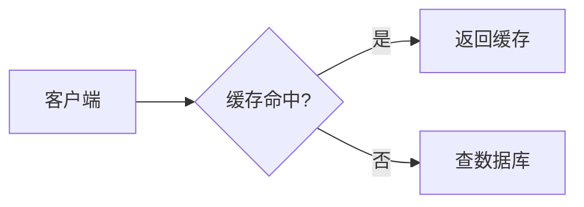

# ChenBlog

基于 **Hexo + GitHub Pages** 的个人博客系统，0 元部署，并附带一个无需自建服务器的「后台管理」页面（Git 即数据库 / CMS）。

## 功能

后台管理（部署后访问 `你的网站地址/admin/`）：

- 切换用户端背景图片（上传或填写 URL）
- 发布文章（正文支持 Markdown，可上传并插入图片、设置封面图）
- 草稿：保存到 `source/_drafts/`，不会发布到线上；可随时一键发布
- 删除文章
- 修改文章（含修改标题、分类、日期、slug）
- 文章置顶：勾选后首页 / 分类页排在最前
- 确定文章是否可以被评论（每篇文章独立开关）
- 分类的增 / 删 / 改 / 查、排序
- 分类同时作为博客顶部导航栏，每篇文章可挂多个分类
- 在线编辑：文章列表点任意一行进入编辑器，左侧写 Markdown、右侧实时预览；工具栏支持加粗 / 标题 / 列表 / 引用 / 代码 / 链接 / 表格 / 上传插图
- 深链编辑：`/admin/?edit=_posts/xxx.md`（前台「编辑本文」按钮就是这个地址）会直接打开对应文章
- 本地草稿保护：编辑中自动把未保存内容暂存在浏览器，重新进入时可选择「恢复草稿」或「丢弃」
- 快捷键：`Ctrl/⌘+S` 保存，`Ctrl/⌘+B` 加粗，`Ctrl/⌘+I` 斜体，`Ctrl/⌘+K` 链接，`Tab` 缩进；离开前会提醒未保存
- 文章列表支持按标题 / 文件名 / 分类 / 标签搜索、按状态筛选，并带统计概览与「最近更新」
- 保存后显示同步状态：已提交 → GitHub Actions 构建中 → 约 1-2 分钟线上生效，并提供「查看构建」「打开线上文章」

用户端：

- 查看已发布文章（首页列表、分类页、归档页）
- 站内搜索（纯前端静态搜索，基于 `/search.json`）
- 深色 / 浅色主题切换（跟随系统偏好，可手动切换并记住）
- 评论：使用 Giscus（基于 GitHub Discussions，完全免费，无需自建后端）
- 技术文档站式三栏阅读布局：顶栏导航 + 左侧「学习路线 / 最近更新 / 标签云」+ 正文 + 右侧「此页内容」目录（滚动自动高亮）
- 文章头部信息：作者、日期、分类与标签 chips、字数与预计阅读时长
- 代码块带语言标签与一键复制；图片自动带题注（取 alt 文字）；表格、引用、提示块统一排版
- 右下角浮动按钮组：上一篇 / 下一篇 / 目录 / 打印（存 PDF）/ 回到顶部
- 前台（阅读端）**不暴露任何后台入口**：读者看不到编辑按钮、也看不到后台地址
- 首页版式：顶部「最新」推荐块（左标题摘要 / 右日期阅读时长 +「阅读全文」），下方文章卡片网格；**同一行卡片等高对齐**，没有封面图的文章用分类色渐变的占位封面补位，避免参差不齐或留白
- 分类 / 标签页用「左缩略图 + 右正文」的横向列表卡片，信息密度更高
- 轻量动效（尊重系统「减少动态效果」设置）：背景光斑缓慢漂移、首屏分层入场、统计数字滚动、卡片悬停聚光跟随鼠标、封面图加载渐显、顶栏滚动加深阴影、目录条目滑入
- 首页顶部粒子字标：`coderWizard` 被采样成上千个粒子，先散开再聚合成字，鼠标移过会被推开；配色跟随明暗主题，文字在主题配置里随便改（见「七、首页粒子字标」）
- 数学公式：正文里直接写 `$...$`（行内）与 `$$...$$`（独占一行），用 KaTeX 排版，适合放命中率、CPI、香农公式这类推导
- 流程图 / 结构图：```mermaid 代码块渲染成图，随明暗主题换配色，右上角带「源码 / 复制」按钮；CDN 挂掉时自动摊开源码而不是留个空白
- 相关文章：文末按「同标签 +3 / 同分类 +2 / 标题关键词 +1」打分推荐，一篇都没匹配上时退化成最新文章
- 系列连载：front-matter 写 `series: 系列名` 就会在正文开头出现「第 N / M 篇」的系列导航（可选 `series_order` 指定顺序）
- 图片点击放大：正文配图点开看大图，支持左右键切换、`Esc` 关闭、点图放大到原始尺寸、一键打开原图
- 图片体积：上传时先在浏览器里压缩，构建时再把历史图统一缩尺寸、重编码并生成 WebP；正文图自动懒加载并带占位尺寸，一篇文章的首屏图片能从十几 MB 降到几百 KB（见「八、图片体积」）
- 404 页：电路板霓虹风格的「未初始化指针」（`/404.html`），带站内搜索、最近更新与分类入口，帮助读者找回正路
- 订阅与收录：自动生成 `/atom.xml`、`/rss.xml`、`/sitemap.xml`、`/robots.txt`（robots 里屏蔽了 `/admin/` 与 `/search/`）

## 目录结构

```
.
├── _config.yml                 # Hexo 站点配置（改这里的 title / url / root）
├── package.json
├── scripts/                    # 构建期脚本（JS 部分零依赖）
│   ├── search-generator.js     # 生成 /search.json（供前端搜索）
│   ├── math.js                 # 把 $...$ / $$...$$ 抽出来交给前端 KaTeX
│   ├── mermaid.js              # 把 ```mermaid 围栏转成图容器（避免被当成代码高亮）
│   ├── image-html.js           # 正文图片补懒加载 / 占位尺寸，并优先用 WebP（<picture>）
│   ├── optimize-images.py      # 压缩 source/images 并生成 WebP（需要 Pillow）
│   ├── feed-generator.js       # 生成 /atom.xml 与 /rss.xml
│   └── sitemap-generator.js    # 生成 /sitemap.xml 与 /robots.txt
├── source/
│   ├── _data/site.json         # 背景图 + 导航分类（后台会自动读写）
│   ├── _posts/                 # 已发布文章（Markdown，后台会自动读写）
│   ├── _drafts/                # 草稿（不会发布到线上）
│   ├── search/index.md         # 搜索页
│   ├── 404.md                  # 404 页（layout: 404，构建成 /404.html）
│   └── admin/                  # 后台管理（静态页面，直接随站点发布）
├── themes/chen/                # 自定义主题（三栏布局、右侧目录、代码复制、搜索、暗色主题、置顶、评论、等高卡片、光斑与入场动效、首页粒子字标、公式、Mermaid、相关文章、图片放大、404）
└── .github/workflows/deploy.yml
```

## 一、部署到 GitHub Pages

1. 在 GitHub 新建用户主页仓库 `ChenCoder23.github.io`（已按用户主页配置，根路径 `/`）。
   - 以后若想改用普通项目仓库（如 `ChenBlog`），把 `_config.yml` 的 `root` 改为 `/仓库名/`、`url` 改为 `https://ChenCoder23.github.io/仓库名/` 即可。
2. 把本项目推到该仓库的 `main` 分支。
3. 修改 `_config.yml`：
   - `title`：博客名（当前为 `陈会闯的博客`，同时用于顶栏品牌、页脚与 SEO 标题）
   - `author`：作者名（当前为 `陈会闯`，用于文章署名、头像首字与首页副标题）
   - `url`：已填为 `https://ChenCoder23.github.io/`（如需可改）
   - `root`：已填为 `/`（用户主页）
4. 仓库 `Settings` → `Pages` → `Source` 选择 **GitHub Actions**。
5. 打开 `Actions` 页面，首次可能需要点击「I understand my workflows, go ahead and enable them」。
6. 每次 push 到 `main`，Action 会自动构建并发布；后台保存 / 删除 / 上传操作都会触发自动发布。

> 分支名如果不是 `main`，请同时修改 `.github/workflows/deploy.yml` 里的 `branches: [main]` 和后台里填的分支名。

## 二、创建 GitHub Token（后台使用）

后台直接调用 GitHub API 读写仓库，需要一个 **个人访问令牌**：

1. GitHub 右上角头像 → Settings → Developer settings → Personal access tokens → **Fine-grained tokens**（推荐）。
2. Repository access 选择你博客所在的仓库。
3. Permissions 里把 **Contents** 设为 **Read and write**。
4. 生成后复制 token（只显示一次）。

> 也可以使用 Classic token，勾选 `repo` 权限即可。

## 三、使用后台

1. 部署完成后访问 `https://<你的用户名>.github.io/admin/`（项目主页则是 `/仓库名/admin/`）。
2. 首次进入会看到「账号设置」，填入：
   - GitHub Token
   - 用户名 / 组织名
   - 仓库名（已预填 `ChenCoder23.github.io`）
   - 分支（默认 `main`）
   - 站点根路径（已预填 `/`）
3. 点击「保存」后即可管理文章、草稿、分类、背景图。

> 后台地址不会被前台链接出来：想编辑某篇文章时，直接访问 `/admin/`，或在文章列表里点那一行。
> 如果你确实想在文章页底部放一个「编辑本文」按钮（直达 `/admin/?edit=_posts/xxx.md`），
> 把 `themes/chen/_config.yml` 的 `admin.editLink` 改成 `true` 即可，默认是 `false`（不显示）。

> Token 只保存在浏览器 localStorage 中，不会上传到其它服务器。注意不要把 token 提交到仓库里。

## 四、评论系统（Giscus，0 元）

Giscus 用 GitHub Discussions 存储评论，完全免费、无需自建后端。每个 GitHub 账号都可以用。

1. 仓库需为 **public**，并在 `Settings` → `General` → `Features` 里开启 **Discussions**。
2. 到 <https://giscus.app/zh-CN> 按提示安装 Giscus GitHub App 并选择你的仓库，获取配置。
3. 把得到的值填入 `themes/chen/_config.yml`：

```yaml
comments:
  enabled: true
  giscus:
    repo: "你的用户名/你的仓库"
    repo_id: "R_xxx"
    category: "Announcements"
    category_id: "DIC_xxx"
    mapping: "pathname"
    ...
```

4. 发布文章时，在后台勾选 / 取消勾选「允许评论」，即可控制每一篇文章是否显示评论区。

如果暂时不想用 Giscus，也可以：

- **utterances**：同样是 GitHub Issues 评论，配置更简单，把主题里 giscus 的 `<script>` 换成 utterances 脚本即可。
- **Waline / Twikoo**：需要配合免费的 Serverless / 云数据库（如 Vercel + LeanCloud / Supabase），功能更强（访客留言、通知等）。
- **Disqus**：第三方，有广告，国内访问不稳定。

## 五、本地运行（可选）

需要 Node.js 20+：

```bash
npm ci
npx hexo server
```

浏览器打开 <http://localhost:4000> 预览；后台页面为 <http://localhost:4000/admin/>，搜索页为 <http://localhost:4000/search/>。

> 如果本机 `npx` 不可用（Windows 上偶发），可直接用 `node node_modules/hexo-cli/bin/hexo server`、`node node_modules/hexo-cli/bin/hexo generate`。

## 六、写作增强（公式 / 流程图 / 系列）

### 数学公式（KaTeX）

正文里直接写 LaTeX，不需要额外标记：

```markdown
行内公式：缓存命中率 $H = \frac{hits}{hits + misses}$ 直接影响平均访问时间。

独占一行：

$$
\text{CPI} = \frac{\sum (IC_i \times CPI_i)}{IC}
$$
```

- `$` 后面跟空格、`$5 到 $10` 这类金额、以及代码块 / 行内代码里的 `$` 都不会被当作公式
- 单篇不想解析公式：front-matter 写 `math: false`
- 想整体关掉：`themes/chen/_config.yml` 里把 `assets.math.enabled` 改成 `false`

### 流程图 / 结构图（Mermaid）

````markdown

````

`flowchart` / `sequenceDiagram` / `classDiagram` / `stateDiagram-v2` / `gantt` / `pie` 都能写。图的配色跟随前台明暗主题切换，右上角带「源码 / 复制」按钮。

> Mermaid 语法写错时图不会画出来，页面会自动摊开源码并给出提示，方便就地改。

### 系列连载

front-matter 加两项即可：

```yaml
---
title: 进程与线程的区别
categories:
  - 408笔记_计算机操作系统
series: 操作系统复习
series_order: 3
---
```

正文开头会出现「系列 · 操作系统复习 · 第 3 / 5 篇」的导航；排序按 `series_order`（不写就按日期），只有一篇时自动隐藏。

### 相关文章

文末自动推荐，规则是「同标签 +3 分、同分类 +2 分、标题关键词 +1 分」取最高分，一篇都匹配不上时退化成最新文章。条数改 `themes/chen/_config.yml` 的 `post.related`（`0` = 关闭）。

### 订阅与收录

| 文件 | 用途 |
| --- | --- |
| `/atom.xml`、`/rss.xml` | RSS / Atom 订阅（内容一致，页头已自动声明，可直接丢给阅读器） |
| `/sitemap.xml` | 站点地图，已排除 404 页与后台 |
| `/robots.txt` | 允许收录正文，屏蔽 `/admin/` 与 `/search/` |

### 404 页

由 `source/404.md` + `themes/chen/layout/404.ejs` 生成 `/404.html`（GitHub Pages 会自动拿它兜底）。页面上会显示出错的路径、站内搜索框、分类入口与最近更新。

想改风格：调 `themes/chen/source/css/style.css` 第 24 节里的 `--nf-accent`（霓虹色）；不想要电路板装饰，删掉 `404.ejs` 里的 `.nf__traces` 那个 `<svg>` 即可。

## 七、首页粒子字标

首页顶部那行 `coderWizard` 是用粒子拼出来的：先把文字画到离屏 canvas 上，再按固定步长采样成粒子目标点，粒子从四周散开、聚合成字，鼠标移过还会把它们推开。移植自 Vue Bits 的 `<ParticleText />`，但去掉了 Vue 依赖，改写成主题里一致的原生实现（只在首页加载这一个脚本）。

文字与开关都在主题配置里：

```yaml
# themes/chen/_config.yml
particleText:
  enabled: true          # 改成 false 就不再加载粒子脚本，顶部退化成普通渐变文字
  text: "coderWizard"    # 换成别的词也行（英文 / 数字效果最好，全角中文会糊）
```

想微调手感，可以给 `themes/chen/layout/index.ejs` 里那个 `.hero__mark` 容器加 `data-*`：

| 属性 | 默认 | 作用 |
| --- | --- | --- |
| `data-density` | 4 | 采样步长基准（以 106px 字号为准），越小粒子越多；实际步长会跟着字号缩放，手机上的小字自动加密，笔画不会缺 |
| `data-particle-size` | 2 | 单个粒子的尺寸（CSS 像素） |
| `data-scatter` | 180 | 粒子初始散开的距离 |
| `data-gather-duration` | 1600 | 聚合成字的时长（毫秒） |
| `data-stagger` | 420 | 粒子逐个延迟启动的最大值（毫秒） |
| `data-pointer-repel` / `data-repel-radius` | 40 / 120 | 鼠标斥力强度 / 影响半径 |
| `data-idle-drift` | 0.7 | 成形后的轻微呼吸抖动（0 = 完全静止，也更省电） |
| `data-trigger` | `mount` | 什么时候重新散开聚合：`mount` / `hover` / `click` |
| `data-glow` | `true` | 粒子的柔光光晕 |

- 颜色不用手填：粒子本体读容器的 `color`，高光读 `--particle-highlight`（默认 `var(--accent)`），所以明暗主题切换会自动按新配色重建。
- 字号读容器的 `font-size`、字体读 `font-family`，都能在 CSS 里用 `clamp()` 做响应式；文字过宽时会自动缩到容器的 92%。
- 系统开了「减少动态效果」时直接出结果、不做动画；滚动出视口后停止绘制，不空跑 CPU；触屏不做斥力，不影响在字标上滑动翻页。
- 脚本没加载起来（或 `enabled: false`）时，容器里那层普通渐变文字会照常显示，不会留空白。

## 八、图片体积（首屏为什么变快了）

后台是把文件直接提交进仓库的：相机原图、AI 出的图动辄 10MB 以上，原样发布出去读者打开一篇文章要等十几秒。现在有两道关卡：

1. **上传时就压**：`source/admin/admin.js` 里的 `compressImage()` 先在浏览器里把图等比缩到最长边（正文 / 封面 1600，背景 2560）再编码上传，优先 WebP，不支持就退回 JPEG / PNG。压完反而更大、动图、SVG 一律原样上传，不会把图弄坏。
2. **构建时兜底**：`scripts/optimize-images.py` 扫一遍 `source/images`，把历史图（含后台批量传上来的大图）缩到同样的尺寸并重编码，同时在旁边生成一份同名 `.webp`：

```bash
pip install pillow
npm run optimize                            # 等价于 python scripts/optimize-images.py
python scripts/optimize-images.py --dry-run # 只看报告，不写文件
```

- 原图会备份到 `.image-originals/`（已 gitignore），清单 `manifest.json` 记着每个文件的哈希，重复执行不会二次压缩掉画质；RSS / 搜索索引里的地址不受影响。
- `scripts/image-html.js` 在页面渲染完成后统一处理 HTML：补 `loading="lazy"` 与 `decoding="async"`、从清单里补 `width` / `height`（图片没到也不会把版面顶开），存在 `.webp` 时套一层 `<picture>`；老浏览器读不懂 `<source>`，照旧取原图。
- 文章封面是首屏最大的图：模板给它标了 `fetchpriority="high"`，并预加载 WebP 版（`<link rel="preload" type="image/webp">`）；背景壁纸在 CSS 里用 `image-set()` 优先取 WebP。
- 生成的 `.webp` 提交不提交都行：`.github/workflows/deploy.yml` 每次构建前都会自动跑一遍压缩脚本（先 `pip install pillow`），线上拿到的始终是压过的版本。
- 想调尺寸 / 画质：改 `scripts/optimize-images.py` 顶部的 `PRESETS`（按目录给「最长边, JPEG 质量」）与 `DEFAULT_MAX_EDGE` / `DEFAULT_QUALITY`；小于 `MIN_BYTES` 的图不动，`SKIP_SUFFIXES` 里的格式（SVG、GIF 等）直接跳过。
- 实测（本站 14 张图）：`source/images` 从 43.4MB 降到 5.9MB，WebP 版合计 2.3MB；一篇文章的首屏图片（壁纸 + 封面 + 正文图）从约 14.2MB 降到约 583KB。

## 说明

- 后台的「保存 / 删除 / 上传图片」本质是向仓库提交 commit，随后由 GitHub Actions 自动构建发布，所以页面上线会有几十秒到一两分钟的延迟。
- 文章里插入的图片会提交到 `source/images/uploads/`；背景图提交到 `source/images/background/`。图片上传前会在浏览器里先压一道，构建时再统一处理一次（见「八、图片体积」）。
- 草稿保存在 `source/_drafts/`，Hexo 默认不会发布草稿，需在后台点「发布」才会进入 `_posts/`。
- 置顶通过文章 front-matter 的 `sticky: true` 实现；搜索索引只包含已发布文章。
- `_config.yml` 里的 `skip_render: ['admin/**']` 让后台页面原样复制到 `public/admin/`，**不要删除**；否则后台 HTML 会被套进博客主题布局里，页面会错乱。
- 调试外观：地址后加 `?theme=dark` 或 `?theme=light` 可强制前台 / 后台主题，例如 `/admin/?theme=dark`。
- 后台编辑器依赖 marked（Markdown 渲染）与 js-yaml，脚本会按 jsDelivr → 国内镜像 → unpkg 的顺序自动回退；全部加载失败时预览退化为纯文本，不影响保存。
- 公式（KaTeX）与流程图（Mermaid）走 CDN，默认 jsDelivr → unpkg → staticfile 依次回退；换镜像或单独关掉某一项，改 `themes/chen/_config.yml` 的 `assets` 段。断网或全部 CDN 不可用时：公式退回显示 LaTeX 源码，流程图自动摊开源码，页面不会空白。
- 只有正文里真的出现公式 / 流程图的页面才会加载对应脚本（构建期按内容判断），其他页面不额外请求任何第三方资源。
- 404 页在 sitemap 里被排除（`source/404.md` 的 `sitemap: false`），页头也带了 `noindex`，不会被搜索引擎收录。
- 背景是分层画的：`html` 负责底色，`body::before`（壁纸 / 渐变底色）与 `.aurora`（漂移光斑）用负 `z-index` 叠在内容之下。因此 `body` 自身的 `background` **必须保持 `transparent`**，否则会把这两层全部盖住（壁纸和光斑就都看不见了）。
- 想关掉动效：在 `themes/chen/source/css/style.css` 的第 16 节里去掉 `.aurora` / `.js .hero > *` 等规则即可；系统层面开启「减少动态效果」时这些动画会自动停用。
